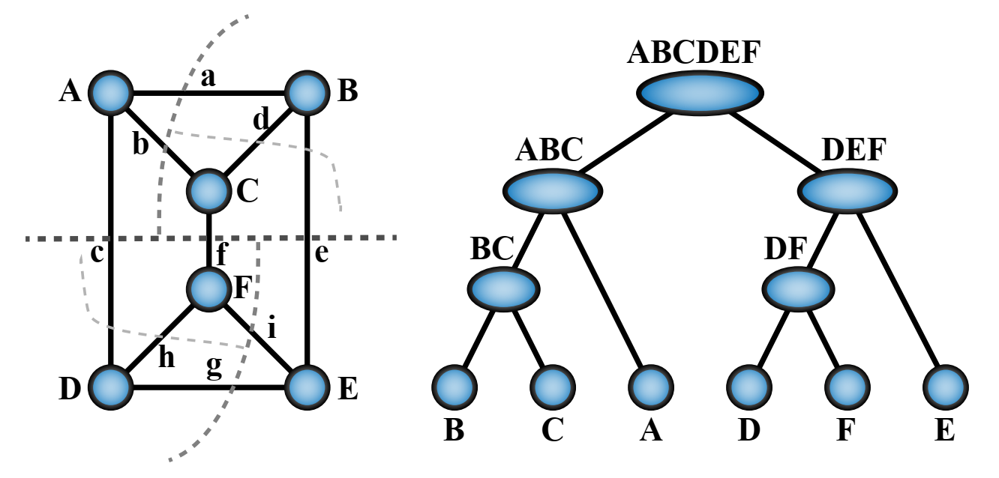
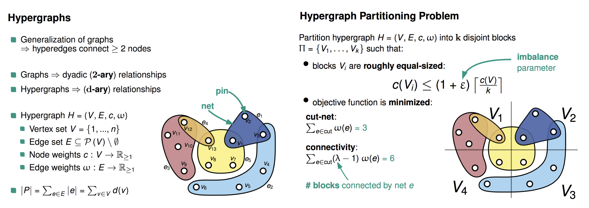
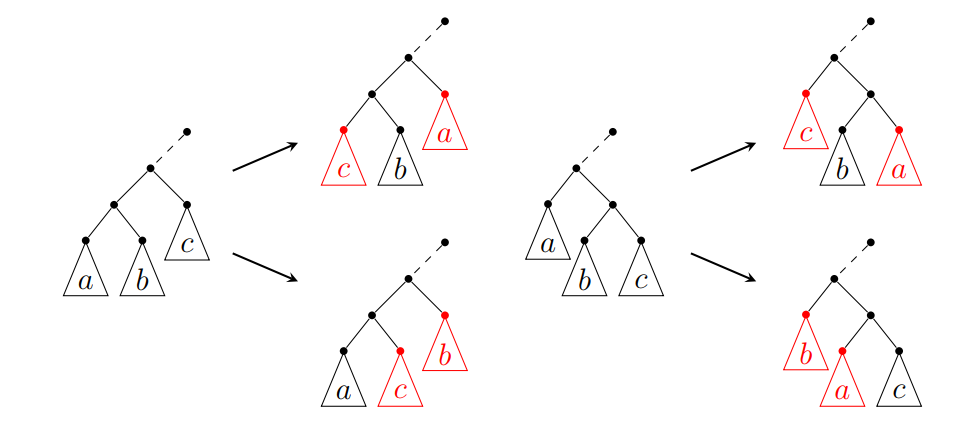
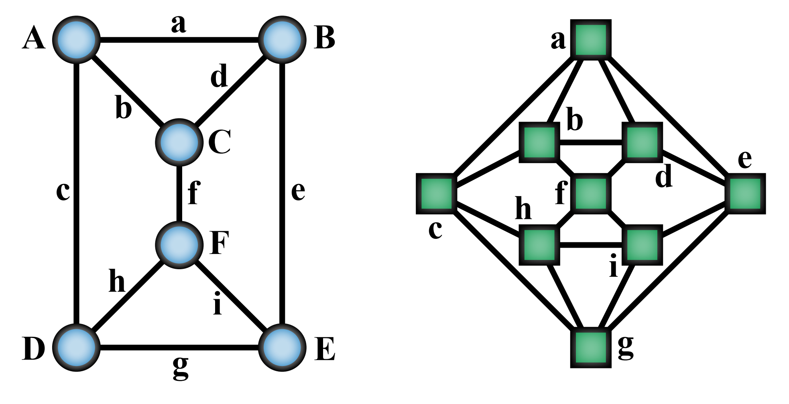

# Tensor Network Contraction Order

Tensor networks are a powerful tool for representing and manipulating high-dimensional data. The contraction of a tensor network is a fundamental operation in tensor network methods. The computational cost of the contraction depends on the order of the contraction, which is the order in which the tensors are multiplied. The optimal contraction order can significantly reduce the computational cost of the contraction. In this note, we introduce the concept of tensor network contraction order and discuss methods for optimizing the contraction order.

## Concepts and Notations

Complexity of a contraction order includes its time complexity and space complexity. The space complexity refers to the largest intermediate tensor generated during the contraction. The time complexity refers to the number of scalar multiplications and additions required to compute the contraction. When optimizing the contraction order, we aim to minimize both of them, while trading off can also be made between them. In most cases, the space complexity is more important.

A given contraction order can be represented as a contraction tree, and since we only apply binary contractions, the tree is a binary tree. The contraction tree can be represented as a rooted tree, where the leaves are the tensors to be contracted and the internal nodes are the intermediate tensors, as show in the following figure.

## Introduction to Methods

In this section, a few widely used methods for contraction order optimization are introduced. Here I mainly refer to the following packages: [Cotengra](https://cotengra.readthedocs.io/en/latest/) [^contengra] and [OMEinsumContractionOrders.jl](https://github.com/TensorBFS/OMEinsumContractionOrders.jl), which are written in `Python` and `Julia`, respectively.

### Greedy Method

The Greedy method is one of the simplest and fastest method for optimizing the contraction order. The idea is to greedily select the pair of tensors with the smallest cost to contract at each step.

In each step, for all possible pairs of tensors, the cost of the contraction is evaluated, and the pair with the smallest cost is selected and then contracted, which forms a new tensor. This process is repeated until all tensors are contracted. This method is fast, however it is easy to be trapped in local minima.

An enhanced method is called the hyper-greedy method, where in each step one does not directly select the pair with the smallest cost, but instead samples according to the Boltzmann distribution given by $\mathcal{P}(v_i, v_j) = e^{-{L(v_i, v_j)} / {T}}$, where $L(v_i, v_j)$ is the cost function. In this case, it is possible for the process to escape from local minima. Then we run this process multiple times and select the best result.

### Binary Partition

As discussed above, the contraction tree is a binary tree, and the greedy method aims to build the tree from the leaves to the root. The binary partition method, on the other hand, aims to partition the tree from the root to the leaves.

A given tensor network can be regarded as a hypergraph, where the tensors are the vertices and the shared indices are the hyperedges, where the cost of contracting a hyper edge can be encoded as its weight. The binary partition method is to partition the hypergraph into two parts, and then recursively partition each part. Cost of each partition can be evaluated by the sum of the weights of the hyperedges cut by the partition, while we prefer to make the partition as balanced as possible (balance means size of the subgraph should be similar). Thus, the problem is reduced to a balanced min cut problem on a hypergraph.

In the past few decades, the graph community has developed many algorithms for the balanced min cut problem and provided the corresponding software packages, such as [KaHyPar](https://kahypar.org) [^kahypar], which has already been used in both OMEinsumContractionOrders.jl and Cotengra.

### Tree Simulating Annealing

Tree simulating annealing (TreeSA) [^treesa] is another type of the optimization method based on local search and simulating annealing. TreeSA is based on the following rules:

* Associativity: $T \times (S \times R) = (T \times S) \times R$,
* Commutativity: $T \times S = S \times T$.

These rules lead to the four possible transforms of the contraction tree as shown in the following figure.

The TreeSA method starts from a random contraction tree and then applies the above rules to transform the tree. The cost of the contraction tree is evaluated and the tree is updated according to the Metropolis criterion. During the process, the temperature is gradually decreased, and the process stop when the temperature is low enough.

### Tree Decomposition Based Method

Another approach is to use tree decomposition of its corresponding line graph to optimize the contraction order. The tree decomposition method is based on the theorem proved in Ref.[^Markov]: 
**Theorem 1**. Let $C$ be a quantum circuit with $T$ gates and whose underlying circuit graph is $G_c$. Then $C$ can be simulated deterministically in time $T^{O(1)} e^{O(tw(G_C))}$, where $tw(G_C)$ is the treewidth of $G_C$. 
Similarly, the contraction order of a tensor network can also be optimized by the treewidth of its corresponding line graph.

#### Line Graph and Tree Decomposition

The relation between the tensor network and it line graph is shown below in the figure, where the indices of the tensor network are the vertices of the line graph, and the vertices are connected in the line graph if they are connected to the same tensors.

The tree decomposition of a graph is a tree whose nodes are subsets of the vertices of the graph, and the following conditions are satisfied:
1. Each vertex of the graph is in at least one node of the tree.
2. For each edge of the graph, there is a node of the tree containing both vertices of the edge.
3. Bags containing the same vertex have to be connected in the tree.

An example is shown in the following figure, where the tree width is two.

  

Once the tree decomposition is obtained, an elimination order of indices can be obtained by traversing the tree, which is equivalent to the contraction order, an example is shown below.

<!-- References -->

[^treesa]: Kalachev, Gleb, Pavel Panteleev, and Man-Hong Yung. “Multi-Tensor Contraction for XEB Verification of Quantum Circuits.” arXiv, May 18, 2022. https://doi.org/10.48550/arXiv.2108.05665.

[^contengra]: Gray, Johnnie, and Stefanos Kourtis. “Hyper-Optimized Tensor Network Contraction.” Quantum 5 (March 15, 2021): 410. https://doi.org/10.22331/q-2021-03-15-410.

[^kahypar]: Schlag, Sebastian, Tobias Heuer, Lars Gottesbüren, Yaroslav Akhremtsev, Christian Schulz, and Peter Sanders. “High-Quality Hypergraph Partitioning.” ACM Journal of Experimental Algorithmics 27 (December 31, 2022): 1–39. https://doi.org/10.1145/3529090.

[^Markov]: Markov, Igor L., and Yaoyun Shi. “Simulating Quantum Computation by Contracting Tensor Networks.” SIAM Journal on Computing 38, no. 3 (January 2008): 963–81. https://doi.org/10.1137/050644756.

<!-- References -->