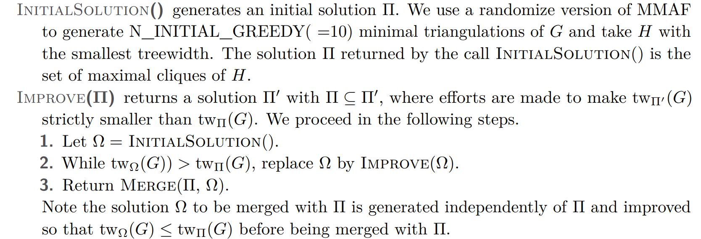

# Tree-width Algorithms for Simple Graphs

In this note, I will introduce various algorithms for computing the tree-width of simple graphs, including the Boudhitté and Todinca dynamic programming algorithm for tree width[^Bouchitté] and the Tamaki2022 algorithm for exact tree width[^Tamaki].

## Introduction to Concepts

In this section, I will introduce the basic concepts and definitions to be used in the following introduction to the algorithms.

### Tree Decomposition and Tree Width

The tree decomposition of a graph is a tree whose nodes are subsets of the vertices of the graph, and the following conditions are satisfied:
1. Each vertex of the graph is in at least one node of the tree.
2. For each edge of the graph, there is a node of the tree containing both vertices of the edge.
3. Bags containing the same vertex have to be connected in the tree.

An example is shown in the following figure, where the tree width is two.

  

For a given tree decomposition, the width of the tree decomposition is defined as the maximum size of the bags minus one, and tree width of graph $G$, $tw(G)$, is defined as the minimum width of all possible tree decompositions of $G$.

### Chordal Graphs

Chordal graph of a graph $G$ is a graph in which every cycle of length four or more has a chord, which is an edge that is not part of the cycle but connects two vertices of the cycle. An example of the chordal graph is shown below. It should be noted that the chordal is not complete, and the chordal graph of a graph is not necessarily unique.

  

With chordal graph, we can further define the minimum triangulation of graphs: Given a simple graph $G$ and a chordal graph $H$, if $V(G) = V(H)$ and $E(G) \subseteq E(H)$, then we call $H$ is a triangulation of $G$. If no proper subset of $H$ is a triangulation of $G$, we call $H$ a minimum triangulation of $G$. An example is shown below.

  

### Potential Maximum Clique and Minimum Separator

The potential maximum cliques and the minimum separators are two important concepts in the tree-width algorithms, since all tree bags are potential maximum cliques and intersections of tree bags are minimum separators.

Maximum clique is a subset of vertices in a graph such that every two distinct vertices in the clique are adjacent, i.e., the clique is complete and cannot be extended by adding another vertex. For a given graph $G$, a potential maximum clique is a subset of vertices that is a maximum clique in one of its minimum triangulation $H$. Generally, a potential maximum clique is labeled as $\Omega$, and the set of all potential maximum cliques is denoted as $\Pi_k(G)$, where $k$ for the maximum size of the clique. If all tree bags of a tree decomposition is in $\Pi_k(G)$, we call the tree decomposition a $k$-tree decomposition and admitted by $\Pi_k(G)$.

For a given connected graph $G$, the $a-b$ separator $S$ is a set of vertices such that the removal of $S$ from $G$ disconnects the vertices $a$ and $b$, and for a minimum separator, no proper subset of $S$ is a separator. All minimum separators are intersections of connected potential maximum cliques. For a given graph $G$ and a set of vertices $K$, $\Delta_G(K)$ represents all separators of $G$ in $K$.

After the removal of $S$, the graph $G$ is divided into a few connected components denoted as $\mathcal{C}_G(S)$. For $C \in \mathcal{C}_G(S)$, we call $(S, C)$ a block associated with $S$. If all vertices in $S$ are adjacent vertices in $C$, we call $(S, C)$ a full block, otherwise, we call it a non-full block. For $\Omega \in \Pi_k(G)$ and $C_i \in \mathcal{C}_G(\Omega)$, we call $(N(C_i), C_i)$ the blocks associated with $\Omega$.

$R(S, C) = G_S[S \cup C]$ represents the realization of $G$ the block $(S, C)$, where $G_S$ for adding an edge between every pair of nonadjacent vertices of $S$. 

## The Algorithms

In this section, I will introduce the algorithms to search the tree-width of a simple graph. Generally speaking, the BT algorithm aims to search the best tree decomposition on a given $\Pi_K(G)$ in $O(|\Pi_K(G)| + |\Delta(G)| + 1)$ times, so that the most direct forward method is to work on all possible p.m.c and minimum separator. Thus, I will start with the algorithm to search all possible potential maximum cliques and minimum separators.

### Searching Potential Maximum Clique and Minimum Separator

First we try to search all minimum separators of a given graph $G$, by searching all possible full components of $G$. Since for a minimum $u-v$ separator $S$, $u \in C_u$ and $v \in C_u$, where $C_u$ and $C_v$ are connected components in $G/S$, then both $(S, C_u)$ and $(S, C_v)$ are full blocks and $N(C_u) = N(C_v) = S$. 

Thus, for each set of connected vertices $K$ with size $1 \leq |K| \leq n / 2$, by treating $N(K)$ as a separator and check if it's a minimal, we can search all minimum separators of $G$., it can be proved that the complexity of this process is of $O(1.6181^n)$.

Then we further try to search all potential maximum cliques, according to the following Lemma:
For Every potential maximal clique $\Omega$ of $G(V, E)$, there exists a vertex set $Z \subseteq V$ and $z \in Z$ such that:
* $|Z| - 1 \leq \frac{2}{3} (N - |\Omega|)$
* $G[Z]$ is connected
* $\Omega = N(Z / \{z\})$ or $\Omega = N(Z) \cup \{z\}$

Thus, by searching all possible connect subgraph of $G$, we can get all potential maximum cliques, which can be done in $O(1.7549^n)$ time.

### The Boudhitté-Todinca Algorithm

The BT algorithm is a dynamic programming algorithm to search the tree-width of a simple graph. First I will introduce the basic idea of this algorithm via a cops-robber game, and then I will introduce the dynamic programming algorithm.

#### Understanding the BT algorithm via the cops-robber game

In this game, we assume a cop player and a robber player. In each step, the cop player can occupy set of vertices $C$, which should be a potential maximum clique or a minimum separator, and move continuously until the robber player is trapped. The robber player can move to any connected subgraph $R$ that are components of $G/C$ and is connected to his current position. The game ends when the robber player is trapped, i.e. cannot move to any vertex. Tree-width of the graph equals to the minimum size of $max(C)$ that the cop player can win.

With $\Pi(G)$ and $\Delta(G)$, we can check all possible state, defined as $(C, R)$, where $C \in \Pi(G)$ and $R \in \Delta(G)$. Two state is connected if they are two consecutive steps in the game, so that all states forms a graph with size of $O(|\Pi(G)| + |\Delta(G)| + 1)$. To see can the cops win, we label the starting point as $(\emptyset, G)$, and the ending point as $(C, \emptyset)$. If $C \in \Pi(G)$ we call that a put step, otherwise we call that a remove step.

To check the if the cops can win, we can start from labeling all ending points. Then we label the remove steps if all its neighbors are labeled, and label the put steps they have labeled neighbors. Finally, If the starting point is labeled, then the cops can win, otherwise the robber can win.

#### The dynamic programming algorithm

With the above understanding, we can now introduce the BT dynamic programming algorithm with given $\Delta(G)$ and $\Pi(G)$:

### The Tamaki2022 Algorithm

In the section above, it is shown that the BT algorithm can search the best tree decomposition in a set of $\Pi(G)$ and $\Delta(G)$. However, exhaustively enumerate all elements in $\Pi(G)$ and $\Delta(G)$ is not efficient, which limits the application of the BT algorithm. 

In the following section, I will introduce a recent algorithm by Tamaki in 2022, which is improved based on the BT algorithm. The Tamaki2022 algorithm search the upper bound and the lower bound of the tree-width of a graph at the same time, which leads to more concise and efficient algorithm.

#### Upper bound algorithm

In the upper bound part, the algorithm search the subset $\Pi(G)$ instead of directly searching a tree decomposition, since the BT algorithm can find the optimal tree decomposition admitted by $\Pi(G)$ in $O(\Pi(G))$ time. The algorithm starts from a greedy search and iteratively update the $\Pi(G)$, by merging sets together, and expect to get lower tree width.

In this algorithm, we start from initial sets $\Pi(G)$ and $\Omega(G)$ via greedy search or other methods, and then we try to merge these sets, with elements in $\Pi(G)$ and $\Omega(G)$ and some new potential cliques.

Assume $X \in \Pi(G)$ and $Y \in \Omega(G)$, and $X \cap Y = \emptyset$, $X \subseteq (Y, C)$, $Y \subseteq (X, D)$. Let $U = N[C] \cap N[D]$ and $H$ the graph as $G[U]$ with edges in $K(N[B])$, where $B$ is the blocks associated with $U$ in $G$, let $\hat{H}$ be a minimum triangulation of $H$. If $tw(\hat{H}) \leq tw_\Pi(G)$, then we can merge $X$, $Y$ and all maximum cliques in $\hat{H}$ to get a new set of potential maximum clique, whose tree width is at most $max(tw_\Pi, tw_\Omega)$.

The algorithm can be summarized as follows:

#### Lower bound algorithm

For the lower bound, the algorithm consider the tree width of a minor of $G$, which has a smaller tree width than $G$. By iteratively updating the upper bound and lower bound, the algorithm can finally get the exact tree width of $G$.

The lower bound is not important for our purpose of find an optimal contraction order.

<!-- Reference -->

[^Bouchitté]: Bouchitté, Vincent, and Ioan Todinca. “Treewidth and Minimum Fill-in: Grouping the Minimal Separators.” SIAM Journal on Computing 31, no. 1 (January 2001): 212–32. https://doi.org/10.1137/S0097539799359683.

[^Tamaki]: Tamaki, Hisao. “Heuristic Computation of Exact Treewidth.” Application/pdf, 2022, 16 pages, 743963 bytes. https://doi.org/10.4230/LIPICS.SEA.2022.17.
